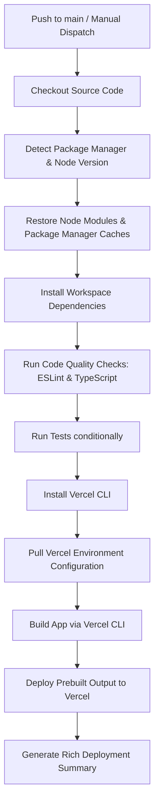

# Vercel CI/CD Deployment Documentation

This document explains the CI/CD deployment pipeline for the **FreightFlow** application, deploying from a private GitHub Organization repository to Vercel Hobby using the Vercel CLI.

---

## Table of Contents
1. [How Deployment Works](#how-deployment-works)
2. [Required GitHub Secrets](#required-github-secrets)
3. [How to Obtain Vercel Secrets](#how-to-obtain-vercel-secrets)
4. [How to Rotate Tokens](#how-to-rotate-tokens)
5. [How to Deploy Manually](#how-to-deploy-manually)
6. [How to Rerun the Workflow](#how-to-rerun-the-workflow)
7. [Troubleshooting](#troubleshooting)

---

## How Deployment Works

The CI/CD pipeline runs on every push to the `main` branch or when triggered manually via `workflow_dispatch`. It performs the following sequence of steps:



---

## Required GitHub Secrets

Configure these secrets in your repository settings under **Settings > Secrets and variables > Actions**:

| Secret Name | Description | Example |
| :--- | :--- | :--- |
| `VERCEL_TOKEN` | Vercel Personal Access Token | `lpqXw1b4sA2019c...` |
| `VERCEL_ORG_ID` | Vercel User/Organization Team ID | `team_abc123...` |
| `VERCEL_PROJECT_ID` | Vercel Project ID associated with FreightFlow | `prj_xyz789...` |

---

## How to Obtain Vercel Secrets

### 1. `VERCEL_TOKEN`
1. Navigate to [Vercel Account Tokens](https://vercel.com/account/tokens).
2. Click **Create** or **Create Token**.
3. Set a name (e.g., `GitHub-Actions-CI-CD`) and choose the appropriate scope/expiration.
4. Copy the generated token immediately (it will only be displayed once).

### 2. `VERCEL_ORG_ID`
1. If you are deploying to a personal account (Hobby):
   - Locate your **User ID** in [Vercel Account Settings](https://vercel.com/account).
   - Alternatively, install Vercel CLI locally, run `vercel link`, and look at `.vercel/project.json` inside the `orgId` key.
2. If you are deploying to a team (Pro):
   - Open your Vercel team dashboard, click on team settings, and copy the **Team ID** (starts with `team_`).

### 3. `VERCEL_PROJECT_ID`
1. Navigate to the project dashboard on Vercel.
2. Go to **Settings > General**.
3. Under the **Project ID** section, copy the unique ID string (starts with `prj_`).

---

## How to Rotate Tokens

If your `VERCEL_TOKEN` is compromised or needs periodic rotation:
1. Generate a new token by following the steps in [How to Obtain Vercel Secrets](#1-vercel_token).
2. Go to your GitHub Repository -> **Settings > Secrets and variables > Actions**.
3. Click the pencil icon next to `VERCEL_TOKEN` and paste the new token. Click **Update secret**.
4. Go back to Vercel Account Tokens and delete the old token to deactivate it immediately.

---

## How to Deploy Manually

In case GitHub Actions is experiencing downtime, or you need to perform an emergency manual deployment:

1. **Install Vercel CLI globally:**
   ```bash
   npm install -g vercel@latest
   ```

2. **Authenticate with Vercel:**
   ```bash
   vercel login
   ```

3. **Link your local directory to Vercel (first time only):**
   ```bash
   vercel link
   ```

4. **Pull project settings:**
   ```bash
   vercel pull --yes --environment=production
   ```

5. **Build the production artifacts locally:**
   ```bash
   vercel build --prod
   ```

6. **Deploy the prebuilt output:**
   ```bash
   vercel deploy --prebuilt --prod
   ```

---

## How to Rerun the Workflow

If a transient network error or API timeout occurs:
1. Navigate to the **Actions** tab in your GitHub repository.
2. Select the **Production Deployment to Vercel** workflow.
3. Click on the failed run.
4. Click the **Re-run jobs** button in the top right and select **Re-run all jobs**.

---

## Troubleshooting

### 1. ESLint or TypeScript Fails
**Symptom**: The pipeline terminates early during the `Run Code Quality Checks` step.
**Fix**: Run `pnpm lint` and `pnpm type-check` locally to resolve any linting issues or compiler errors. The pipeline is configured to fail on errors to avoid deploying broken code.

### 2. "Project not linked" or "Invalid credentials"
**Symptom**: The `Pull Vercel Environment` step fails with credentials errors.
**Fix**: Verify that `VERCEL_TOKEN`, `VERCEL_ORG_ID`, and `VERCEL_PROJECT_ID` are configured correctly as GitHub Secrets and have not expired or been deleted from your Vercel account.

### 3. Database / Prisma Client Errors
**Symptom**: Next.js build fails because Prisma query engine files are missing.
**Fix**: Ensure your `next.config.ts` includes the custom engine copy directives (like `outputFileTracingIncludes`) and that the Prisma Client was correctly generated via the workspace installation step (`pnpm db:generate`).
